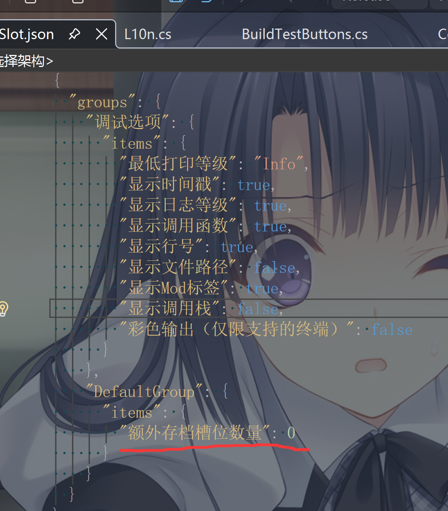

# 更好的存档位 - 复制粘贴+108存档槽
# 前言
其实挺早就打算写这个MOD的，结果中途官方多加了几个存档就先没写了

# 功能
## 快速复制存档

主要功能是给每个存档槽增加一个复制粘贴

点击复制后，点击粘贴可以将存档带备份一起粘贴到某个存档槽

粘贴时会询问是否确认覆盖

粘贴会带着备份一起粘贴，方便存档管理
## 额外存档位

在存档路径下的JmcModLibConfig文件夹下找到`BetterSaveSlot.json`下的“额外存档槽位数量”修改键值

或者安装ModSetting后在游戏内修改即可自行更改额外存档槽的数量，额外数量最多可达102个，加上游戏自带的6个，你最多可拥有108个存档位：

我想108个应该对大部分人来说够了吧！

# 安装
本MOD需要前置[JmcModLib](https://steamcommunity.com/sharedfiles/filedetails/?id=3613297900)、[Harmony](https://steamcommunity.com/sharedfiles/filedetails/?id=3589088839)，请务必将这两个放在本MOD前加载

如果需要游戏内修改额外存档槽数量，请安装[ModSetting](https://steamcommunity.com/sharedfiles/filedetails/?id=3595729494)

# 提示
本MOD删除存档位并不会实际删除对应的存档，因此不用担心MOD挂掉会导致存档安全问题

# 相关链接
[Github仓库](https://github.com/JMC2002/Duckov-BetterSaveSlot)

[创意工坊链接](https://steamcommunity.com/sharedfiles/filedetails/?id=3614076662)

[演示视频](https://www.bilibili.com/video/BV1V4URBPER7/?share_source=copy_web&vd_source=44d0c79301287bc97d360d78d8e0ec0f)

# 其他
- 本MOD内置了游戏支持的所有语言的`.csv`，如果对翻译不满意，可以自行修改MOD文件夹下的`Lang`文件夹下的对应语言的`.csv`文件进行调整
- 如需反馈交流，可以入群[点击入群（617674584）](http://qm.qq.com/cgi-bin/qm/qr?_wv=1027&k=Kii1sz9bmNmgEgnmsasbKn6h3etgSoQR&authKey=Hni0nbFlbd%2BfDZ1GoklCdtHw4r79SuEsHvz9Pi4qs020w1f8D2DHD8EEnNN1OXo6&noverify=0&group_code=617674584)
- 如果有任何问题或者建议，欢迎在讨论区留言，如果对你有帮助，希望可以点一个Star和一个赞~
